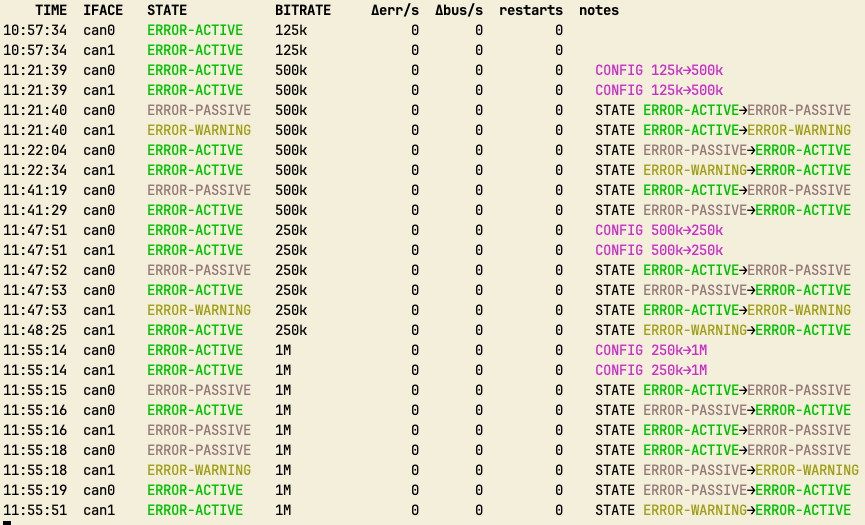

# canconf / canmon

Two small, single-purpose tools for people who spend their day staring at CAN
buses on Linux:

- **`canconf`** — reconfigure every SocketCAN / CAN-FD interface in one terse
  command, introspect the hardware, inspect the live configuration.
- **`canmon`** — passive, read-only health monitor: state transitions,
  configuration changes, auto-restarts, and bit-error bursts — printed only
  when something actually happens.

Both are pure Python 3.9+ stdlib, zero runtime dependencies, installable as a
single `pipx install canconf` and immediately useful.

## Why this exists

Automotive CAN work — diagnostics, ECU flashing, gateway reverse-engineering,
bench-testing on the sofa — spends an embarrassing amount of time on the same
fiddly chores:

- **Changing bitrates**. Different ECUs, different generations, different
  vehicle platforms all want different line speeds. Switching from 500k to 250k
  to 1M to FD-at-2M happens several times a day. The stock `ip link` CLI
  wants half a dozen sudo-flavoured incantations for each iface, in the right
  order, with the right keywords — an error-prone tax on iteration speed.
- **Keeping two interfaces in lock-step.** Dual-channel USB adapters and
  bench rigs with T-tap into the same bus mean every parameter change has to
  be mirrored across both ifaces. Forget one and your capture is misleading.
- **Knowing the bus is healthy.** When an ECU flash spirals into bus-off, or
  a faulty transceiver starts cooking bit errors, you want to *see it* — not
  realise hours later that half your log is garbage.
- **Knowing what the hardware can actually do.** Is this adapter FD-capable?
  What bitrates will its clock + timing constants support? Which kernel driver
  backs it? The answers are all there in `/sys` and netlink, but nobody types
  `jq '.linkinfo.info_data.bittiming_const'` for fun.

`canconf` and `canmon` compress those chores into commands short enough to
actually type during a debug loop. If you use `mcangen`, `candump`, python-can,
or any of the canmatrix family to do real work on the bus, these are the tools
that keep the plumbing out of your way.

## Installation

### pipx — recommended

Installs the two binaries into an isolated venv and puts `canconf` and `canmon`
on your `PATH`:

```bash
pipx install canconf
```

### pip

```bash
pip install canconf
```

### From source

```bash
git clone https://github.com/mickeyl/canconf
cd canconf
pipx install .      # or: pip install -e .
```

No runtime deps. Needs only `iproute2` (you already have it) and `sudo`
(`canconf` self-elevates; `canmon` stays non-privileged).

## canconf

Replaces:

```bash
sudo ip link set can0 down
sudo ip link set can1 down
sudo ip link set can0 type can bitrate 500000 dbitrate 2000000 sample-point 0.875 dsample-point 0.75 fd on
sudo ip link set can1 type can bitrate 500000 dbitrate 2000000 sample-point 0.875 dsample-point 0.75 fd on
sudo ip link set can0 txqueuelen 10000
sudo ip link set can1 txqueuelen 10000
sudo ip link set can0 up
sudo ip link set can1 up
```

with:

```bash
canconf 500k/2M@0.875/0.75
```

### Grammar

```
canconf                         show status of all can* interfaces
canconf 500k                    classic CAN @ 500 kbit/s, all interfaces, up
canconf 500k/2M                 CAN-FD: nominal 500k, data 2M
canconf 500k/2M@0.875/0.75      same, with nominal & data sample points
canconf off    |    down        bring all interfaces down
canconf up                      bring all interfaces up (no reconfigure)
canconf bitrates                show achievable bitrates per interface
```

Positional spec: `BITRATE[/DBITRATE][@SP[/DSP]]`. Bitrates accept the suffixes
`k`/`M` (`125k`, `500k`, `1M`, `2M`, `5M`, `8M`).

### Features

- Discovers all CAN interfaces by ARPHRD type (so `can*`, `vcan*`, `slcan*` are all picked up — no name matching).
- One compact spec for classic CAN and CAN-FD alike.
- `canconf bitrates` reports the driver, reference clock, the achievable bitrate envelope (derived from `bittiming_const`), which standard bitrates fall within it, and whether the hardware supports CAN-FD at all. No brute-forcing, all introspection.
- Sets `txqueuelen 10000` by default (the kernel default of 10 is painfully low for anything other than idle buses).
- Prints the live post-apply state — including `qlen` and the underlying driver — so you can verify the driver actually accepted what you asked for (drivers silently round bitrates to what the clock can produce).
- ANSI colour with sensible auto-detection, `NO_COLOR`/`FORCE_COLOR`, and a `--no-color` flag.
- Self-elevates to root via `sudo`; `--dry-run` is completely non-privileged.

### Options

| Flag | Description |
|------|-------------|
| `-i`, `--ifaces a,b,c` | Restrict to these interfaces (default: all CAN interfaces) |
| `-r`, `--restart-ms N` | Auto-restart on bus-off after N ms |
| `--listen-only` | Listen-only mode |
| `--loopback` | Loopback mode |
| `--one-shot` | One-shot mode |
| `--berr` | Enable bus error reporting |
| `--term OHM` | Set termination resistor (if the hardware supports it) |
| `--txqueuelen N` | Override the tx queue length (default: 10000) |
| `-n`, `--dry-run` | Print the `ip` commands that would run, do nothing |
| `-v`, `--verbose` | Print each `ip` command as it runs |
| `-q`, `--quiet` | Suppress the post-apply status dump |
| `--no-color` | Disable ANSI colour |
| `-V`, `--version` | Print version and exit |
| `-h`, `--help` | Show help |

### Example session

```
❯ canconf
can0  UP  CAN  500k  sp 0.875  qlen 10000  drv gs_usb
can1  UP  CAN  500k  sp 0.875  qlen 10000  drv gs_usb

❯ canconf 500k/2M@0.875/0.75
[sudo] password for mickey:
can0  UP  CAN-FD  500k/2M  sp 0.875/0.750  qlen 10000  drv gs_usb
can1  UP  CAN-FD  500k/2M  sp 0.875/0.750  qlen 10000  drv gs_usb

❯ canconf bitrates
=== can0 ===
  driver:    gs_usb
  clock:     40 MHz
  nominal:   202 .. 13333333
  standard:  10k, 20k, 50k, 100k, 125k, 250k, 500k, 800k, 1M
  FD data:   25510 .. 13333333
  FD std:    1M, 2M, 4M, 5M, 8M

=== can1 ===
  driver:    gs_usb
  clock:     48 MHz
  nominal:   1875 .. 16M
  standard:  10k, 20k, 50k, 100k, 125k, 250k, 500k, 800k, 1M
  FD:        not supported

❯ canconf -n 1M -i can0
+ ip link set can0 down
+ ip link set can0 type can bitrate 1000000
+ ip link set can0 txqueuelen 10000
+ ip link set can0 up
```

## canmon

`canmon` tails every CAN interface at 1 Hz (tunable). It prints the current
state once at startup and then **stays silent**, emitting a new row only when
something actually changes: a state transition, a bittiming change, an
auto-restart, or a tick in which the CAN controller bit-error rate exceeds a
threshold. It needs no root and reads only from `ip -j -details -s link show`
plus `/sys/class/net` — no CAN traffic is injected, intercepted, or generated.



```
❯ canmon -r 0.5 -t 5
    TIME  IFACE   STATE           BITRATE     Δerr/s  Δbus/s  restarts  notes
14:23:45  can0    ERROR-ACTIVE    500k             0       0         0
14:23:45  can1    ERROR-ACTIVE    500k/2M          0       0         0
14:23:46  can0    ERROR-WARNING   500k            12       8         0  STATE ERROR-ACTIVE→ERROR-WARNING  BIT-ERRORS 8/s > 5/s
14:23:48  can0    BUS-OFF         500k             4      14         0  STATE ERROR-WARNING→BUS-OFF  BIT-ERRORS 14/s > 5/s
14:23:52  can0    ERROR-ACTIVE    500k             0       0         1  STATE BUS-OFF→ERROR-ACTIVE  RESTART #1
```

(Between 14:23:46 and 14:23:48, and at any other tick with no change, nothing
is printed. Pass `-v` to force a row every tick.)

### Options

| Flag | Description |
|------|-------------|
| `-i`, `--ifaces a,b,c` | Restrict to these interfaces |
| `-r`, `--rate SECONDS` | Tick interval (default: 1.0) |
| `-t`, `--err-rate N`   | Threshold for the `Δbus/s` flag (default: 1) |
| `-o`, `--once`         | Print initial snapshot and exit |
| `-v`, `--verbose`      | Emit a row every tick, not just on change |
| `--no-color`           | Disable ANSI colour |
| `-V`, `--version`      | Print version and exit |
| `-h`, `--help`         | Show help |

### Columns

- **Δerr/s** — frame-level `rx+tx` error delta per second (from driver `stats64`).
- **Δbus/s** — CAN controller bit-error delta per second (from `info_xstats.bus_error`). The number you probably care about most during ECU flashes, cable swaps, or suspect wiring.
- **restarts** — running total of driver-initiated auto-restarts after bus-off (requires `canconf … -r MS` to be non-zero at configure time).
- **notes** — event tags: `STATE a→b`, `CONFIG a→b`, `RESTART #N`, `BIT-ERRORS N/s > T/s`. In a colour-capable terminal each tag is coloured by severity, and state tokens are rendered in the same colour as the state column so bus-off transitions jump out.

## Roadmap

Things I intend to build as soon as the underlying itch scratches hard enough.
Contributions welcome; open an issue first if it's non-trivial.

### Short-term

- **JSON output** (`canconf --json`, `canmon --json`) for scripting and for
  wiring the tools into dashboards or CI.
- **Bus-load metrics in `canmon`** — frames/s, bytes/s, and estimated line
  utilisation (%) derived from the driver's rx/tx counters and the active
  bitrate. All the inputs are already read each tick.
- **Config profiles** — `~/.config/canconf/profiles.toml` so you can name
  frequently-used configurations and apply them with `canconf @passive-500k`
  or `canconf @my-ecu`. Profile files track sample-point, FD, termination,
  listen-only, restart-ms, and per-iface overrides.
- **`canconf save`/`canconf apply`** — dump the current configuration of all
  interfaces to a profile file, and re-apply it later. Handy for sharing bus
  setups between workstations.

### Medium-term

- **`canscan`** — sibling tool. Auto-detect the bitrate of an unknown bus by
  entering listen-only mode and trying each standard rate until frames arrive
  cleanly. Useful when probing an unknown vehicle network.
- **`canfind`** — map `canX` interfaces back to the physical adapter: USB
  VID:PID, serial number, USB port path, product string. Indispensable when
  four identical USB-CAN dongles are plugged in.
- **`cansync`** — one-shot synchronised down→configure→up across interfaces,
  with an optional `--at <time>` for lab rigs that need deterministic startup.
- **Daemon mode for `canmon`** — long-running process that emits to
  syslog/journald (for ops use) and exposes a Prometheus text-format
  endpoint (for lab dashboards and long-term bus health recording).

### Longer-term / speculative

- **python-can integration** — provide a small import so `canconf.discover()`
  can feed bus factories, and so python-can users get the same topology
  awareness without re-implementing it.
- **Test-mode** — `canconf test` sends a handful of frames between discovered
  interfaces (pair-wise or via loopback) and verifies the wiring and bitrate
  match end-to-end. Catches bench setup errors before you chase them in
  protocol logs.
- **Termination auto-probe** — some CAN transceivers can report whether the
  bus looks correctly terminated. If the driver exposes it, `canmon` should
  surface it alongside the state column.

## License

MIT — see [LICENSE](LICENSE).
